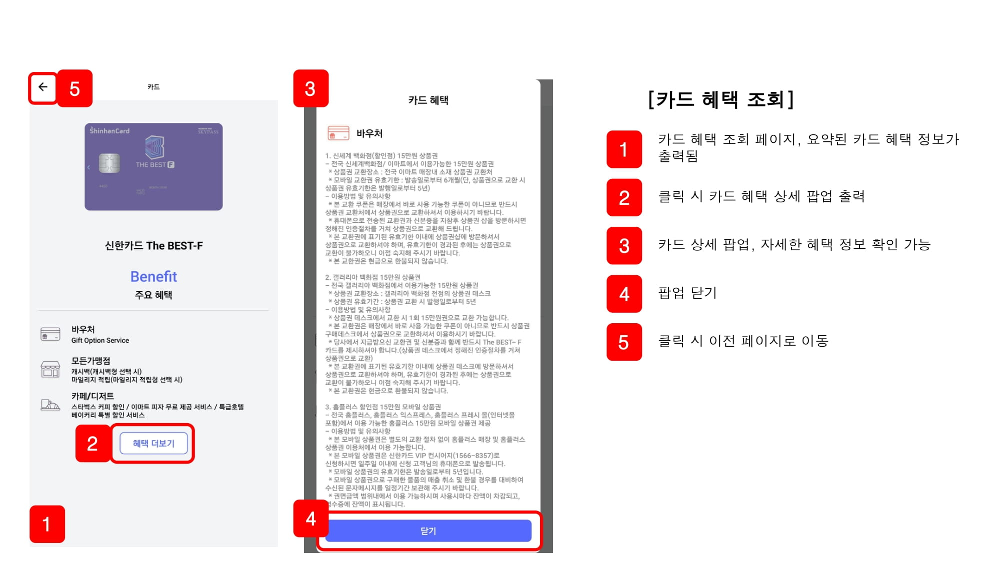
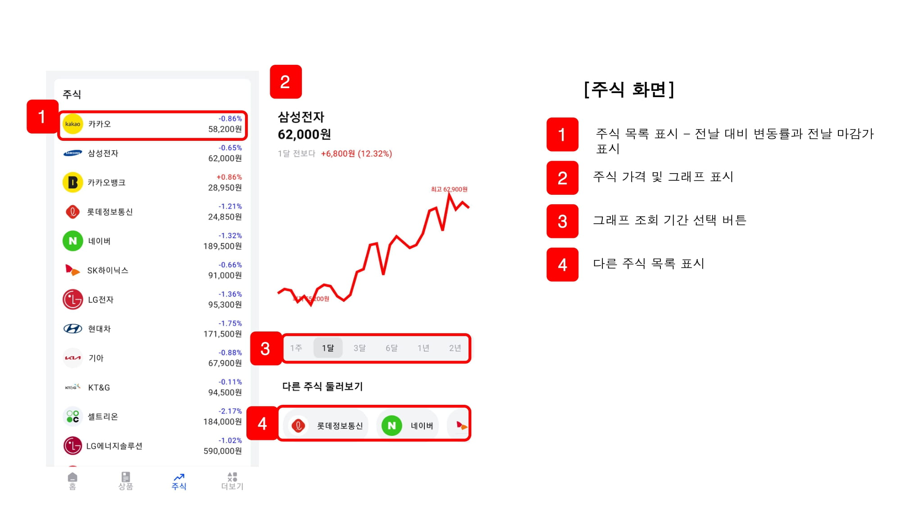
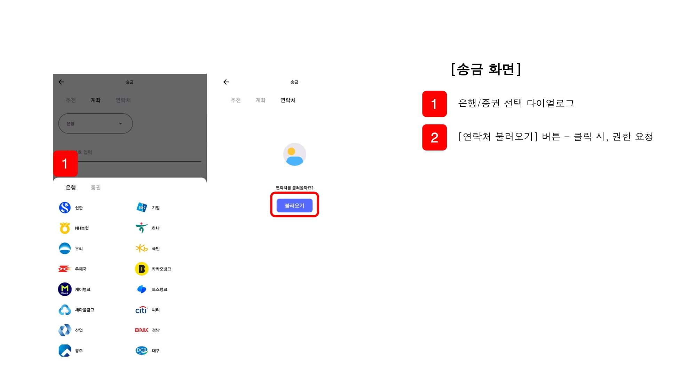

  

  <h5 style="font-weight: bold;">↑ GIF 파일을 클릭하면 UCC를 볼 수 있어요!</h5>
   
   

# 목차

1. [**서비스 소개**](#1)
1. [**기능 소개**](#3)
1. [**기술 스택**](#4)
1. [**프로젝트 진행 및 산출물**](#5)
1. [**개발 멤버 및 회고**](#6)

 

---

 

# 💳 서비스 소개

## 개요

- 한줄 소개 : 신한은행 기업연계 프로젝트 - 금융 통합 네트워크 애플리케이션
- 서비스 명 : **`SOL#`**

## 요구사항

1. 은행, 카드, 증권 등의 금융 네트워크 통합 플랫폼
2. 은행 주요 거래 기본 기능
3. UI/UX 개선
4. 고객 유입을 위한 추가 기능: *모두의 통장*, *이스터 에그*

# 💵 기능 소개

# 💰 기술 스택

## 시스템 아키텍쳐

## Jetpack Compose

Jetpack Compose는 네이티브 UI를 빌드하기 위한 Android의 최신 툴킷입니다. 직관적인 Kotlin API로 Android에서의 UI 개발을 간소화하고 가속화하여 앱에 생동감을 더해줍니다. Android UI를 더 빠르고 쉽게 빌드할 수 있습니다. Compose를 사용하면 Android View 시스템을 사용할 때에 비해 더 적은 코드로 더 많은 작업을 할 수 있습니다. 버튼, 목록 또는 애니메이션이 있으므로 이제 무엇을 빌드해야 하든 코드는 조금만 작성해도 됩니다. 또 Compose는 선언적 API를 사용합니다. 즉, Compose가 나머지를 처리하므로 UI를 설명하기만 하면 됩니다. API는 직관적이므로 찾아서 사용하기가 쉽습니다.

자세한 특징은 아래 [링크](https://developer.android.com/jetpack/compose/why-adopt?hl=ko#less-code)를 참고해주세요.

## FastAPI

> FastAPI는 현대적이고, 빠르며(고성능), 파이썬 표준 타입 힌트에 기초한 Python3.6+의 API를 빌드하기 위한 웹 프레임워크입니다.

 
1. 계정 생성에 따른 더미데이터 생성 서버 
2. 주식데이터 pandas를 이용하여 정제 후 mysql에 적재 서버 (스케쥴링은 spring boot 사용하였습니다)

# 💸 프로젝트 진행 및 산출물

## 프로젝트 진행

### 1. Git flow
---
Git flow 사용을 위해 `sourcetree` 프로그램을 사용하였고 우아한 형제들의 [git flow](https://techblog.woowahan.com/2553/)을 참고.

android 와 back 으로 나누어 `faature`의 하위 브랜치를 사용하였으며 매일 오전 스크럼 이후 `back` 브랜치와 `android` 브랜치로 merge 하여 사용.
 

`commit message`는 `feat(기능명): 내용` 과 같이 통일하여 작성. 

   

### 2. Jira
---
매주 월요일 오전 회의에서 금주의 진행 이슈를 백로그에 등록.

전주에 완료하지 못한 이슈나, 앞으로 진행할 이슈들을 추가함.
- 에픽은 회원, 송금, 계좌, 카드 등으로 구성.
- 레이블은 back, android 등으로 구성.
- 스토리는 명확한 전달을 위하여 `API 명세서 작성`와 같이 작성.
- 작업현황을 실시간으로 지라에 반영하여 현재 팀원이 어떤 작업을 하고있는지, 일정에 딜레이가 있는지 한 눈에 알아볼 수 있게 함.
 

## 프로젝트 산출물

### 1. Figma

 

### 2. ERD

 

### 3. API 문서

# 💎 개발 멤버 및 회고

- [민경욱](https://github.com/rrkcl7733) :
 이번 프로젝트에선 데이터 서버(FastAPI)를 따로두어 관리했습니다. 데이터를 다루기에 용이한 Python 기반의 프레임워크로 처음 사용에 비해 빠른 코드 작성이 가능했습니다. 개발 후반부엔 6명이 Android Studio에 모두 투입되어 화면 구성에 힘썼습니다. 오랜만에 프론트 작업인 것과 Kotlin으로 작업해야 하는부분이 걱정이었는데 팀원들의 격려로 무사히 잘 마무리 할 수 있었습니다.
- [김찬영](https://github.com/letgodchan0) :
    매일 사용하는 모바일 금융 어플리케이션을 직접 개발해 볼 수 있었던 좋은 경험이였습니다. 특히 신한은행과 연계해서 원장 데이터에 대한 공부를 하면서 금융 도메인에 대한 이해를 쌓을 수 있었습니다. 
  이번 프로젝트는 기존의 금융 서비스를 제공하면서도, 화면과 동작 부분이 개선되고, 사용자들을 유입시킬만한 기능이 있는 어플리케이션을 만드는 것이었기 때문에, 기존의 금융 어플들을 많이 사용해 보면서 인사이트를 얻고 적용해야 하는 부분이 가장 중요했던 것 같습니다. 개발 관련 부분으로 Kotlin과 Spring boot로 백엔드 개발을 맡아서 진행했고, 모두의 통장 기능에 대해서는 안드로이드 개발도 진행했습니다. 화면과 서버 모두 개발을 해보면서, 데이터를 주고 받는 것에 대해 새로운 시각을 얻을 수 있었던 것 같습니다. 싸피에서 마지막 프로젝트로 좋은 경험할 수 있었고, 안드로이드 개발을 위해 매일 같이 야근하며 진행한 팀원들에게 고생했다는 말 전하고 싶습니다!

- [이지나](https://github.com/dlwlsk0428) :
   
- [이주영](https://github.com/2weeks0) :
   Jetpack compose와 MVVM 디자인 패턴을 위한 Jetpack ViewModel과 hilt 등 평소 관심 있었던 라이브러리를 활용해볼 수 있었던 프로젝트였습니다. 안드로이드 작업량이 많아 여유가 없었는데, 유능한 백엔드 친구들이 서버 구성을 마치고, 안드로이드 개발을 도와줘서 목표로 했던 퀄리티를 순조롭게 맞출 수 있었습니다. 이로써, 5개월 동안 함께 했던 팀원들과의 모든 프로젝트가 끝났는데, 팀원들 모두 많은 것을 얻을 수 있었던 시간이 됐기를 바라고, 앞으로 건강하고 행복하길 바랍니다!!
- [정건우](https://github.com/abcxj123) :
   
- [채윤선](https://github.com/younsunchae) :